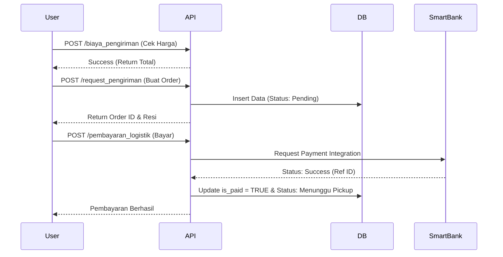

# LogistiKita - Documentation Web Service API (V1.0)

LogistiKita adalah platform logistik modern yang menyediakan layanan backend berbasis RESTful API untuk pengelolaan pengiriman barang, perhitungan biaya otomatis, pelacakan paket secara real-time, dan integrasi sistem pembayaran perbankan (SmartBank).

---

## Arsitektur Sistem
Aplikasi ini dibangun menggunakan arsitektur **MVC (Model-View-Controller)** murni dengan PHP Native:
- **Routing**: Ditangani oleh `index.php` dan `.htaccess`.
- **Controllers**: Berada di `app/Controllers/`, menangani logika bisnis dan response JSON.
- **Models**: Berada di `app/Models/`, menangani interaksi langsung dengan database MySQL.
- **Views**: Berada di `app/Views/` (HTML/JS) yang bertindak sebagai client yang mengonsumsi API ini.

---

##  Memulai (Setup)

### Prasyarat
- XAMPP / Laragon (PHP >= 7.4)
- MySQL Database

### Instalasi
1. Clone atau copy folder project ke `htdocs`.
2. Jalankan Apache dan MySQL.
3. Akses `http://localhost/progress_tubes/logistikita_tubes/setup.php` untuk menginisialisasi database dan tabel secara otomatis.
4. Base URL API: `http://localhost/progress_tubes/logistikita_tubes/api/`

---

##  Standar Komunikasi API

### Headers
Setiap request `POST` **Wajib** menyertakan header:
```http
Content-Type: application/json
```

### Struktur Response Global
Response selalu dikembalikan dalam format JSON:
```json
{
  "status": "success", // atau "error"
  "message": "Deskripsi hasil operasi",
  "data": { ... } // Berisi data object atau array (opsional)
}
```

---

##  1. Modul Autentikasi (`/auth`)

### 1.1 Registrasi Akun
Mendaftarkan user baru ke sistem.
- **Endpoint**: `POST /auth/register`
- **Payload**:
  | Field | Tipe | Deskripsi |
  | :--- | :--- | :--- |
  | `name` | String | Nama lengkap pengguna |
  | `email` | String | Email unik untuk login |
  | `password` | String | Password akun |
  | `role` | String | `user` (default), `kurir`, atau `admin` |

### 1.2 Login
Autentikasi dan pengambilan token.
- **Endpoint**: `POST /auth/login`
- **Payload**: `email`, `password`
- **Response Data**: Mengembalikan object user beserta `token` (Base64 Encoded JSON berisi ID & Role).

---

##  2. Modul Pengiriman (`/logistikita`)

### 2.1 Kalkulasi Biaya (Cek Ongkir)
Menghitung estimasi biaya sebelum melakukan order.
- **Endpoint**: `POST /logistikita/biaya_pengiriman`
- **Payload**:
  | Field | Tipe | Deskripsi |
  | :--- | :--- | :--- |
  | `asal` | String | Kota asal |
  | `tujuan` | String | Kota tujuan |
  | `berat` | Float | Berat barang dalam KG |
  | `layanan` | String | `Reguler`, `Express`, atau `Priority` |
  | `asuransi` | Boolean | (Optional) `true` / `false` |
  | `nilai_barang`| Int | (Required jika asuransi true) Nilai barang untuk hitung premi |

### 2.2 Membuat Request Pengiriman
Input data order pengiriman ke database.
- **Endpoint**: `POST /logistikita/request_pengiriman`
- **Payload**: `user_id`, `penerima_nama`, `penerima_telp`, `penerima_alamat`, `berat`, `layanan`, `biaya_ongkir`.
- **Logic**: Sistem otomatis memberikan nomor resi (Format: `LKT-YYYYMMDD-XXXXX`) dan menghitung **Biaya Layanan (5%)**.

### 2.3 Daftar Pengiriman
Mengambil riwayat data pengiriman.
- **Endpoint**: `GET /logistikita/daftar_pengiriman`
- **Query Params**:
  - `type`: `all` (Admin), `user` (Pelanggan), `kurir` (Kurir).
  - `user_id`: Diperlukan jika type adalah `user`.

---

##  3. Modul Pelacakan (`/tracking`)

### 3.1 Cek Status (Pelacakan)
- **Endpoint**: `GET /logistikita/tracking_status?resi=NOMOR_RESI`
- **Response**: Mengembalikan detail pengiriman lengkap beserta **Riwayat Status (Timeline)** dari yang terbaru.

### 3.2 Update Status (Khusus Kurir/Admin)
- **Endpoint**: `POST /logistikita/tracking_status`
- **Payload**:
  | Field | Tipe | Deskripsi |
  | :--- | :--- | :--- |
  | `resi` | String | Nomor resi paket |
  | `status` | String | `pickup`, `transit`, `delivery`, atau `delivered` |
  | `lokasi` | String | Lokasi saat ini (Contoh: "Hub Jakarta") |
  | `keterangan`| String | Catatan tambahan status |

---

##  4. Integrasi Pembayaran SmartBank

Sistem ini terintegrasi dengan simulasi API SmartBank untuk menangani transaksi keuangan secara aman.

### 4.1 Pembayaran Pengiriman
- **Endpoint**: `POST /logistikita/pembayaran_logistik`
- **Payload**: `{"pengiriman_id": 123}`
- **Alur Kerja**:
  1. API memvalidasi keberadaan ID pengiriman.
  2. API memanggil `SmartBank::processTransaction`.
  3. Jika sukses, status pengiriman berubah menjadi `menunggu_pickup` dan `is_paid = TRUE`.
  4. Data transaksi dicatat di tabel `pembayaran`.

---

##  5. Skema Data (Database)

| Tabel | Fungsi Utama |
| :--- | :--- |
| `users` | Menyimpan data kredensial dan role pengguna. |
| `pengiriman` | Tabel utama data paket, biaya, dan status pembayaran. |
| `layanan` | Master data tipe layanan (Reguler, Express, dll). |
| `riwayat_status`| Log setiap perubahan posisi/status paket (Timeline). |
| `pembayaran` | Record referensi bank dan nominal transaksi sukses. |

---

##  Workflow Integrasi



---

##  Testing dengan Postman
1. **Import Collection**: Anda dapat memasukkan Base URL ke Postman.
2. **Body**: Pilih tab `Body` -> `raw` -> `JSON`.
3. **Contoh Error Handling**: Jika Anda mengirim field yang kurang, API akan merespon:
   ```json
   {
     "status": "error",
     "message": "Field penerima_nama is required."
   }
   ```

---
**LogistiKita API v1.0** - *Built for Speed and Reliability.*
