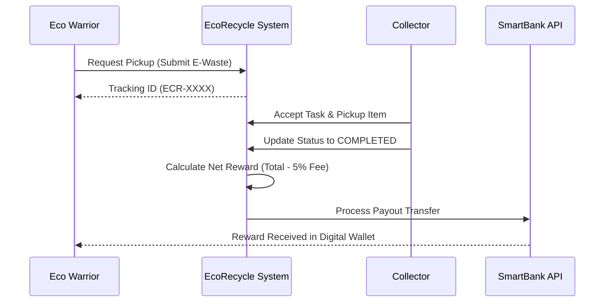

#  EcoRecycle - Smart E-Waste Reverse Logistics (V1.0)

EcoRecycle adalah platform inovatif yang dirancang untuk mengelola rantai pasok terbalik (reverse logistics) khusus sampah elektronik (e-waste). Platform ini memfasilitasi siklus hidup produk elektronik mulai dari akhir penggunaan (end-of-life) hingga proses daur ulang yang bertanggung jawab, sambil memberikan insentif ekonomi kepada pengguna.

---

##  Deskripsi Proyek
Masalah sampah elektronik (e-waste) global terus meningkat. EcoRecycle hadir sebagai jembatan antara konsumen (**Eco Warriors**) dan fasilitas pengolahan sampah (**Collectors**). Dengan sistem pelacakan berbasis tracking number unik dan integrasi reward otomatis, kita dapat memastikan e-waste tidak berakhir di TPA, melainkan didaur ulang secara efisien untuk mendukung ekonomi sirkular.

---

##  Fitur Utama
1.  **Smart E-Waste Estimator**: Hitung potensi reward berdasarkan berat dan kategori sampah elektronik.
2.  **Reverse Logistics Tracking**: Lacak perjalanan sampah Anda dari penjemputan hingga proses akhir daur ulang.
3.  **Automated Eco-Rewards**: Integrasi pembayaran otomatis via SmartBank API setelah sampah diverifikasi.
4.  **Multi-Role Dashboard**: Panel khusus untuk Eco Warriors (Penyetor), Expert Collectors (Kurir), dan Eco Admin (Pengelola).
5.  **Interactive Maps**: Penentuan lokasi penjemputan dan navigasi kolektor menggunakan Leaflet.js.
6.  **`transactions`**: Integrasi keuangan (Payouts) hasil reward.

---

##  Logika Bisnis & Aturan Reward
Untuk menjaga keberlanjutan platform, EcoRecycle menerapkan aturan keuangan berikut:
1.  **Estimasi Reward**: Dihitung berdasarkan `Berat (KG) x Rate Kategori`.
2.  **Handling Fee**: Setiap transaksi dikenakan biaya operasional sebesar **5%** dari total reward gross.
3.  **Net Reward**: Nilai yang diterima pengguna adalah `Gross Reward - 5% Fee`.
4.  **Verifikasi Kolektor**: Reward hanya akan diproses jika Kolektor telah menekan tombol "Selesai Verifikasi" yang menandakan barang sudah sesuai dengan deskripsi.

---

##  Arsitektur & Teknologi

### Tech Stack
- **Backend**: PHP 7.4/8.x (Native MVC Architecture)
- **Database**: MySQL / MariaDB
- **Frontend**: HTML5, Vanilla CSS3 (Modern Tech Design), JavaScript (Vanilla ES6)
- **Libraries**: SweetAlert2 (Notifications), Leaflet.js (Mapping), Chart.js (Analytics), FontAwesome 6 (Icons)

### Persyaratan Sistem
- **Server**: Apache / Nginx (Recommended: XAMPP / Laragon)
- **PHP Version**: 7.4 ke atas
- **Database**: MySQL 5.7+ atau MariaDB 10.4+
- **Browser**: Modern Browser (Chrome, Edge, Firefox, Safari) dengan dukungan JavaScript aktif.

### Struktur Folder
```text
/logistikita_tubes
├── app/
│   ├── Config/         # Konfigurasi Database & Global
│   ├── Controllers/    # Handler API & Logika Bisnis (MVC)
│   ├── Models/         # Abstraksi Data & Query SQL (MVC)
│   └── Views/          # Template HTML (Landing, Dashboard, Admin, Collector)
├── assets/
│   ├── css/            # UI Styling (style.css, admin.css, dashboard.css)
│   ├── js/             # Frontend Logic (home.js, dashboard.js, admin.js)
│   └── img/            # Aset Gambar & Media (High-Quality Generated)
├── index.php           # Front Controller & API Router (Routing System)
├── setup.php           # Database Auto-Installer & Seeder
└── README.md           # Dokumentasi Teknis Lengkap
```

---

##  Skema Database (Smart Schema)
Aplikasi ini menggunakan database `ecorecycle` dengan struktur yang dioptimalkan:

### 1. Tabel `users`
| Kolom | Tipe | Deskripsi |
| --- | --- | --- |
| `id` | INT (PK) | ID Unik Pengguna |
| `name` | VARCHAR | Nama Lengkap |
| `email` | VARCHAR | Email (Unique) |
| `password` | VARCHAR | Password Hash |
| `role` | ENUM | `user`, `collector`, `admin` |

### 2. Tabel `waste_categories`
| Kolom | Tipe | Deskripsi |
| --- | --- | --- |
| `id` | INT (PK) | ID Kategori |
| `name` | VARCHAR | Contoh: Gadgets, Computers |
| `rate_per_kg` | DECIMAL | Nilai reward per kilogram |

### 3. Tabel `pickups`
| Kolom | Tipe | Deskripsi |
| --- | --- | --- |
| `id` | INT (PK) | ID Penjemputan |
| `tracking_number` | VARCHAR | Nomor Unik (ECR-...) |
| `user_id` | INT (FK) | Referensi ke tabel `users` |
| `status` | ENUM | `pending`, `processing`, `transit`, `completed` |
| `reward_amount` | DECIMAL | Total reward yang diterima |

---

##  Panduan Instalasi (Step-by-Step)

### 1. Persiapan Environment
- Pastikan Anda memiliki server lokal (XAMPP/Laragon) dengan **PHP minimal versi 7.4**.
- Pastikan ekstensi `mysqli` dan `json` sudah aktif di PHP Anda.

### 2. Setup Project
1.  Download atau clone project ini.
2.  Letakkan di folder root server Anda (Contoh: `C:/xampp/htdocs/progress_tubes/logistikita_tubes/`).

### 3. Inisialisasi Database
Buka browser dan akses alamat berikut:
`http://localhost/progress_tubes/logistikita_tubes/setup.php`

> [!IMPORTANT]
> Script ini akan secara otomatis:
> - Membuat database **`ecorecycle`**.
> - Membuat semua tabel dan relasi.
> - Mengisi data awal (**Seeding**) kategori sampah.
> - Membuat akun demo: **Admin** (admin@eco.com), **Collector** (coll@eco.com), dan **User** (user@eco.com) dengan password `password123`.

---

##  Cara Penggunaan Aplikasi

###  Sebagai Eco Warrior (User)
1.  **Login/Register**: Masuk ke dashboard pengguna.
2.  **Request Pickup**: Klik "Setor Sampah Baru", pilih kategori (misal: Laptop), isi berat estimasi dan alamat penjemputan.
3.  **Monitor**: Cek status penjemputan secara berkala di tab "Status Penjemputan".
4.  **Reward**: Setelah status selesai, saldo reward akan otomatis masuk ke profil Anda.

###  Sebagai Expert Collector (Kurir)
1.  **Terima Tugas**: Lihat daftar antrean penjemputan di wilayah Anda.
2.  **Navigasi**: Gunakan peta interaktif untuk menuju lokasi donor.
3.  **Update Status**: Setelah sampah diambil, ubah status menjadi `transit` dan akhirnya `completed` setelah diverifikasi di hub.

###  Sebagai Eco Admin
1.  **Monitoring**: Pantau statistik total e-waste yang berhasil didaur ulang.
2.  **User Management**: Kelola data pengguna dan kolektor.
3.  **Finance Control**: Verifikasi pencairan reward yang dilakukan sistem.

---

##  Dokumentasi API (Web Service)

### 1. Modul Autentikasi
- **Login**: `POST /api/auth/login`
- **Register**: `POST /api/auth/register`

### 2. Modul E-Waste
#### **Request Penjemputan**
- **Endpoint**: `POST /api/ecorecycle/request_pickup`
- **Contoh Request**:
  ```json
  {
    "user_id": 1,
    "category": "Computers",
    "weight_kg": 5,
    "pickup_address": "Jl. Merdeka No. 1, Bandung"
  }
  ```

#### **Cek Status Tracking**
- **Endpoint**: `GET /api/ecorecycle/pickup_status?tracking_number=ECR-XXXXX`

---

##  Alur Kerja Sistem (Workflow)



---

##  Pemecahan Masalah (Troubleshooting)
- **Koneksi Gagal**: Cek `app/Config/Database.php` dan pastikan kredensial database Anda benar.
- **Tampilan Berantakan**: Pastikan file CSS di `assets/css/` dapat diakses dan tidak terblokir oleh permission folder.
- **API Return 404**: Gunakan server Apache dengan `.htaccess` aktif untuk mendukung routing URL cantik.

---
**EcoRecycle Project** - *Turning E-Waste into Eco-Wealth.*
Dibuat dengan ❤️ untuk masa depan bumi yang lebih hijau.
