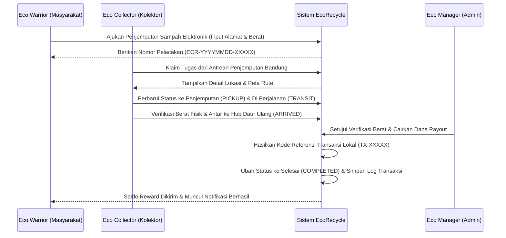

# EcoRecycle - Smart E-Waste Reverse Logistics (V2.0)

EcoRecycle adalah platform inovatif yang dirancang untuk mengelola rantai pasok terbalik (reverse logistics) khusus sampah elektronik (e-waste) di wilayah Bandung (Kota, Kabupaten, dan KBB). Platform ini memfasilitasi siklus hidup produk elektronik mulai dari akhir penggunaan (end-of-life) hingga proses daur ulang yang bertanggung jawab di hub daur ulang, sambil memberikan insentif ekonomi digital kepada pengguna.

---

## 🌟 Deskripsi Proyek
Masalah sampah elektronik (e-waste) global terus meningkat. EcoRecycle hadir sebagai jembatan antara konsumen (**Eco Warriors**), mitra penjemputan lapangan (**Eco Collectors**), dan manajer keuangan/operasional (**Eco Managers**). Dengan sistem pelacakan berbasis tracking number unik dan integrasi reward otomatis via E-Wallet / Transfer Bank, kita dapat memastikan e-waste tidak berakhir di TPA, melainkan didaur ulang secara efisien untuk mendukung ekonomi sirkular.

---

## 🛠️ Fitur Utama

1. **Carbon & Eco-Reward Estimator**: Hitung potensi reward finansial dan kontribusi pengurangan emisi CO2 berdasarkan berat (KG) dan kategori sampah elektronik.
2. **Reverse Logistics Tracking**: Lacak perjalanan sampah elektronik Anda dengan timeline interaktif (Pending ➔ Dijemput ➔ Transit ➔ Tiba di Hub ➔ Selesai & Dibayar).
3. **Automated Eco-Rewards Payout**: Integrasi pembayaran otomatis digital via E-Wallet / Transfer Bank setelah sampah elektronik tiba di hub dan diverifikasi oleh Eco Manager.
4. **Gamified Eco-Level & Impact Score**: Klasifikasi pengguna berdasarkan total donasi sampah elektronik (Bronze Saver, Silver Guardian, Emerald Hero) yang dihitung secara dinamis.
5. **Interactive Maps (Leaflet.js)**: Penentuan rute penjemputan donor oleh kolektor secara interaktif di wilayah Bandung.
6. **Multi-Role Dashboard**: Panel terintegrasi untuk 3 target pengguna utama:
   - **Eco Warriors** (Melihat status donasi, grafik tren bulanan, estimasi karbon, & dompet digital).
   - **Eco Collectors** (Menerima antrean pickup Bandung, navigasi maps, & klaim komisi).
   - **Eco Managers / Admin** (Analitik volume e-waste, live map kolektor, & validasi payout reward).

---

## 📐 Arsitektur & Teknologi

### Tech Stack
- **Backend**: PHP 7.4/8.x (Native MVC Architecture dengan Prepared Statements & Signed Token)
- **Database**: MySQL / MariaDB (Optimasi Skema)
- **Frontend**: HTML5, Vanilla CSS3 (Modern Tech Design), JavaScript (Vanilla ES6)
- **Pustaka**: SweetAlert2 (Notifikasi UI), Leaflet.js (Peta Rute), Chart.js (Grafik Analitik)

### Persyaratan Sistem
- **Server**: Apache / Nginx (XAMPP / Laragon)
- **PHP Version**: 7.4 ke atas (dengan ekstensi `mysqli` dan `json` aktif)
- **Database**: MySQL 5.7+ atau MariaDB 10.4+

### Struktur Folder Proyek
```text
/tubes_pemrograman3
├── app/
│   ├── Config/         # Konfigurasi Database & Global
│   │   └── Database.php
│   ├── Controllers/    # Handler API & Logika Bisnis (MVC)
│   │   ├── BaseController.php      # Controller Induk (Signed Tokens & REST Codes)
│   │   ├── AuthController.php      # Autentikasi Pengguna & Registrasi
│   │   └── EcoRecycleController.php # Logika E-Waste & Payout
│   ├── Models/         # Abstraksi Data & Query SQL (MVC)
│   │   ├── User.php
│   │   └── WastePickup.php
│   └── Views/          # Template Antarmuka HTML
│       ├── index.html              # Landing Page Terfokus (Conversion-Oriented)
│       ├── login.html              # Autentikasi Masuk
│       ├── register.html           # Pendaftaran Akun
│       ├── dashboard.html          # Portal Eco Warrior
│       ├── collector.html          # Portal Eco Collector
│       ├── admin.html              # Portal Eco Manager
│       └── profile.html            # Manajemen Akun Pengguna
├── assets/
│   ├── css/            # UI Styling (style.css, admin.css, dashboard.css, collector.css)
│   ├── js/             # Front Logic (home.js, auth.js, dashboard.js, admin.js, collector.js)
│   └── img/            # Aset Gambar & Media
├── index.php           # Front Controller & API Router
├── setup.php           # Database Auto-Installer & Seeder
└── README.md           # Dokumentasi Teknis Lengkap
```

---

## 🔒 Skema Keamanan & Database

Basis data `ecorecycle` menggunakan relasi data yang optimal dengan skema berikut:

### 1. Tabel `users`
Menyimpan akun pengguna. Password diamankan dengan hash `password_hash()`.
Role yang didukung: `admin` (Eco Manager), `collector` (Eco Collector), `user` (Eco Warrior).

### 2. Tabel `waste_categories`
Daftar kategori sampah dan rate reward per kilogram (KG).

### 3. Tabel `pickups`
Tabel transaksi donasi utama. Dilengkapi kolom `collector_id` untuk pemetaan tugas kolektor yang akurat.

### 4. Tabel `pickup_history`
Mencatat detail lini masa dan riwayat mutasi status donasi.

### 5. Tabel `transactions`
Menyimpan log audit transaksi payout reward ke dompet digital / rekening bank pengguna.

---

## 🚀 Panduan Instalasi (Lokal XAMPP)

### 1. Setup Project
1. Clone repositori ini dan letakkan di direktori root server lokal Anda.
   (Contoh: `C:/xampp/htdocs/progress_tubes/tubes_pemrograman3/`).
2. Pastikan MySQL/MariaDB server Anda sudah aktif di XAMPP Control Panel.

### 2. Inisialisasi Database
Jalankan skrip auto-installer melalui command line di direktori proyek:
```bash
php setup.php
```
*Skrip ini secara otomatis membuat database `ecorecycle`, menginisialisasi semua tabel dengan relasi kunci asing, dan menyuntikkan data awal kategori sampah beserta akun demo.*

### 3. Kredensial Akun Demo
Setelah inisialisasi basis data selesai, Anda dapat login menggunakan kredensial demo berikut (password default: `password123`):
* **Eco Manager (Admin)**: `admin@ecorecycle.com`
* **Eco Collector (Kolektor)**: `collector@ecorecycle.com`
* **Eco Warrior (User)**: `user@ecorecycle.com`

---

## 🌐 Dokumentasi API (Web Service)

Semua request API mengembalikan respons JSON seragam dengan header CORS dan HTTP response status codes yang tepat (misal: 201 Created, 401 Unauthorized, 405 Method Not Allowed).

### 1. Autentikasi Pengguna
* **Login**: `POST /api/auth/login`
  - Input: `{"email": "...", "password": "..."}`
  - Output: Mengembalikan Signed Token (HMAC SHA256) untuk hak akses di request berikutnya.
* **Register**: `POST /api/auth/register`
  - Input: `{"name": "...", "email": "...", "password": "...", "role": "user"}`

### 2. Pengelolaan E-Waste (Memerlukan Token Autentikasi)
* **Request Penjemputan**: `POST /api/ecorecycle/request_pickup`
  - Header: `Authorization: Bearer <token>`
  - Input: `{"category": "...", "weight_kg": ..., "pickup_address": "...", "contact_phone": "...", "item_description": "..."}`
* **Ambil Tugas (Kolektor)**: `POST /api/ecorecycle/assign_collector`
  - Header: `Authorization: Bearer <token>`
  - Input: `{"tracking_number": "ECR-XXXX-XXXXX"}`
* **Pembaruan Status Misi**: `POST /api/ecorecycle/pickup_status`
  - Header: `Authorization: Bearer <token>`
  - Input: `{"tracking_number": "ECR-...", "status": "transit|arrived", "location": "...", "notes": "..."}`
* **Lacak Tracking Number**: `GET /api/ecorecycle/pickup_status?tracking_number=ECR-...`
* **Kalkulator Estimator**: `POST /api/ecorecycle/estimate_reward`
  - Input: `{"category": "...", "weight_kg": ...}`
* **Pencairan Reward (Admin)**: `POST /api/ecorecycle/process_payout`
  - Header: `Authorization: Bearer <token>`
  - Input: `{"pickup_id": ...}`

---

## 🔄 Alur Kerja Sistem (Workflow)



---

## 🛠️ Pemecahan Masalah (Troubleshooting)

1. **Gagal Setup Database**: Periksa kembali konfigurasi host, port, dan user di `app/Config/Database.php`. Jika Anda menggunakan konfigurasi non-standard di server produksi, atur variabel lingkungan berikut: `DB_HOST`, `DB_USER`, `DB_PASS`, `DB_NAME`.
2. **Koneksi Database Terputus**: Pastikan driver `mysqli` terpasang di modul PHP server Anda.
3. **API Mengembalikan Error 401**: Pastikan header `Authorization` dikirimkan dalam format `Bearer <token>` dan token belum kadaluwarsa (berlaku 24 jam setelah login).

---
**EcoRecycle Project** - *Turning E-Waste into Eco-Wealth.*
Dibuat dengan ❤️ untuk menjaga kelestarian lingkungan dan ekosistem hijau di Bandung.
