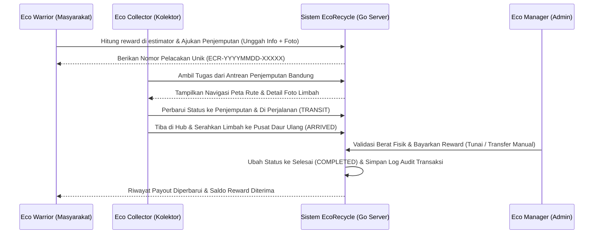

# EcoRecycle - Smart E-Waste Recycling Management Platform (V2.0 Go Edition)

EcoRecycle adalah platform inovatif yang dirancang untuk mengelola rantai pasok pengumpulan dan daur ulang khusus sampah elektronik (e-waste) di wilayah Bandung (Kota, Kabupaten, dan KBB). Platform ini memfasilitasi siklus hidup produk elektronik mulai dari akhir penggunaan (end-of-life) hingga proses daur ulang yang bertanggung jawab di hub daur ulang, sambil memberikan insentif ekonomi digital secara langsung kepada pengguna.


## 🌟 Deskripsi Proyek
Masalah sampah elektronik (e-waste) global terus meningkat secara eksponensial. EcoRecycle hadir sebagai jembatan yang menghubungkan konsumen (**Eco Warriors**), mitra penjemputan lapangan (**Eco Collectors**), dan manajer keuangan/operasional (**Eco Managers/Admin**). Dengan sistem pelacakan berbasis tracking number unik dan pembayaran reward langsung (tunai/transfer manual), platform ini memastikan e-waste tidak berakhir di TPA, melainkan didaur ulang secara aman demi mendukung ekonomi sirkular.

---

## 🛠️ Fitur Utama

1. **Carbon & Eco-Reward Estimator**: Hitung potensi reward finansial dan kontribusi pengurangan emisi CO2 berdasarkan berat (KG) dan kategori sampah elektronik secara dinamis.
2. **E-Waste Tracking Timeline**: Lacak perjalanan sampah elektronik Anda dengan timeline interaktif (Pending âž” Dijemput âž” Transit âž” Tiba di Hub âž” Selesai & Dibayar).
3. **Photo Upload Verification**: Fitur unggah foto limbah elektronik saat mengajukan penjemputan untuk memudahkan kolektor melakukan verifikasi visual kondisi awal barang secara remote.
4. **Direct Eco-Rewards Payout**: Pembayaran kompensasi reward secara langsung (tunai atau transfer bank manual) oleh Eco Manager sesaat setelah sampah elektronik tiba di hub dan diverifikasi timbangan fisiknya.
5. **Gamified Eco-Level & Impact Score**: Klasifikasi tingkatan pengguna berdasarkan akumulasi berat sampah elektronik yang didonasikan (Bronze Saver, Silver Guardian, Emerald Hero) yang dihitung secara dinamis.
6. **Interactive Maps (Leaflet.js)**: Pemetaan visual rute perjalanan dan penentuan titik koordinat penjemputan donor oleh kolektor secara interaktif di wilayah Bandung.
7. **Multi-Role Dashboard**: Panel terintegrasi untuk 3 target pengguna utama:
   - **Eco Warriors** (Melihat status donasi, grafik tren bulanan, estimasi karbon, unggah foto sampah, & history payout).
   - **Eco Collectors** (Menerima antrean pickup Bandung, navigasi maps, & klaim komisi hasil penjemputan).
   - **Eco Managers / Admin** (Analitik volume e-waste, live map kolektor, & validasi pembayaran reward secara manual).

---

## 📐 Arsitektur & Teknologi

### Tech Stack
- **Backend (Web Service)**: Go (Golang) 1.24+ (Standalone HTTP Server menggunakan routing native berkinerja tinggi)
- **Database**: MySQL / MariaDB (Koneksi database terkelola dengan database/sql pool)
- **Environment Variables**: Konfigurasi dinamis lokal dimuat secara native melalui parser `.env` mandiri.
- **Frontend**: HTML5, Vanilla CSS3 (Modern Tech HSL Design), JavaScript (Vanilla ES6)
- **Pustaka**: SweetAlert2 (Notifikasi UI), Leaflet.js (Peta Rute), Chart.js (Grafik Tren Bulanan)

### Persyaratan Sistem
- **Go Compiler**: Go 1.24 ke atas
- **Database**: MySQL 5.7+ atau MariaDB 10.4+ (XAMPP MySQL tetap dapat digunakan)

---

## Struktur Folder Proyek
```text
/tubes_pemrograman3
|-- app/
|   `-- Views/                         # Template antarmuka HTML
|       |-- index.html                 # Landing page edukatif
|       |-- auth.html                  # Halaman auth legacy/pendukung
|       |-- login.html                 # Autentikasi masuk
|       |-- register.html              # Pendaftaran akun
|       |-- dashboard.html             # Portal Eco Warrior
|       |-- collector.html             # Portal Eco Collector
|       |-- admin.html                 # Portal Eco Manager/Admin
|       `-- profile.html               # Manajemen profil pengguna
|-- assets/
|   |-- css/                           # Styling frontend
|   |   |-- style.css
|   |   |-- auth.css
|   |   |-- dashboard.css
|   |   |-- collector.css
|   |   `-- admin.css
|   |-- js/                            # Logic frontend
|   |   |-- home.js
|   |   |-- auth.js
|   |   |-- dashboard.js
|   |   |-- collector.js
|   |   `-- admin.js
|   `-- img/                           # Aset gambar dan media
|-- cmd/
|   `-- server/
|       `-- main.go                    # Entry point HTTP server Go
|-- internal/
|   |-- handlers/                      # REST API handler per domain
|   |   |-- auth_handler.go
|   |   |-- pickup_handler.go
|   |   |-- tracking_handler.go
|   |   `-- payout_handler.go
|   |-- middleware/                    # CORS, request parser, response helper
|   |   `-- auth_middleware.go
|   |-- models/                        # Model dan konstanta domain
|   |   |-- user.go
|   |   `-- pickup.go
|   |-- repositories/                  # Akses data MySQL
|   |   |-- user_repository.go
|   |   `-- pickup_repository.go
|   `-- services/                      # Logika pendukung layanan
|       |-- auth_service.go
|       `-- reward_service.go
|-- db_init/
|   `-- db_init.go                     # Database installer dan seeder
|-- uploads/                           # Penyimpanan foto e-waste, Git-ignored
|-- .env                               # Kredensial lokal, Git-ignored
|-- .env.example                       # Template environment variable
|-- .gitignore
|-- go.mod
|-- go.sum
`-- README.md
```

---

## 🔒 Skema Keamanan & Database

Basis data `ecorecycle` menggunakan relasi data yang optimal dengan skema berikut:

### Keamanan Web Service
1. **SQL Injection Prevention**: Seluruh operasi query database menggunakan parameter placeholder `?` (`db.Prepare()` atau `db.QueryRow()`, `db.Exec()`) bawaan driver Go MySQL.
2. **Stateless API Authentication**: Menggunakan sistem **Signed Token kustom** berbasis algoritma **HMAC SHA-256** untuk menjamin keamanan request API tanpa menggunakan session (mencegah pembajakan sesi).
3. **Pemisahan Kredensial**: Semua data sensitif (password DB, JWT Secret Key) disimpan di file `.env` yang diabaikan oleh Git.
4. **Server-Side Input Validation**: 
   - Validasi format email secara presisi.
   - Validasi kekuatan kata sandi minimal 6 karakter saat registrasi.
   - Validasi tipe data numerik positif untuk berat limbah (mencegah nilai negatif).

### Skema Tabel Database
1. **Tabel `users`**: Menyimpan akun pengguna. Password diamankan dengan hash `bcrypt`.
2. **Tabel `waste_categories`**: Daftar kategori sampah elektronik dan rate reward per kilogram (KG).
3. **Tabel `pickups`**: Tabel transaksi donasi utama. Dilengkapi kolom `photo_url` untuk foto limbah dan kolom `collector_id` untuk pemetaan kurir penjemput.
4. **Tabel `pickup_history`**: Mencatat detail lini masa dan riwayat mutasi status donasi.
5. **Tabel `transactions`**: Menyimpan log audit transaksi payout reward langsung ke masyarakat.

---

## 🚀 Panduan Instalasi (Lokal Dev)

### 1. Setup Proyek
1. Clone repositori ini dan letakkan di direktori server lokal Anda.
   (Contoh: `C:/xampp/htdocs/progress_tubes/tubes_pemrograman3/`).
2. Pastikan MySQL/MariaDB server Anda sudah aktif di XAMPP Control Panel (Port `3306`).

### 2. Konfigurasi Environment (.env)
1. Salin berkas `.env.example` menjadi `.env`:
   ```bash
   cp .env.example .env
   ```
2. Sesuaikan kredensial basis data Anda (seperti port, user, password DB) di dalam `.env`.

### 3. Inisialisasi Database
Jalankan skrip inisialisasi basis data dan pengisian awal data seeder:
```powershell
go run db_init/db_init.go
```
*(Catatan: Folder dinamai `db_init` agar Windows UAC tidak memblokir jalannya file executable biner dengan label "setup" / "install" saat eksekusi)*

### 4. Menjalankan Server Go
Kompilasi server utama dan jalankan:
```powershell
go build -o ecorecycle.exe ./cmd/server
.\ecorecycle.exe
```
Buka browser pada alamat: **`http://localhost:8080`**

### 5. Kredensial Akun Demo
Login menggunakan kredensial demo berikut (password default: `password123`):
* **Eco Manager (Admin)**: `admin@ecorecycle.com`
* **Eco Collector (Kolektor)**: `collector@ecorecycle.com`
* **Eco Warrior (User)**: `user@ecorecycle.com`

---

## 🌐 Dokumentasi API (Web Service)

Semua request API mengembalikan respons JSON seragam dengan header CORS dan HTTP response status codes yang tepat (misal: 201 Created, 401 Unauthorized, 405 Method Not Allowed).

### 1. Autentikasi Pengguna
* **Login**: `POST /api/auth/login`
  - Input: `{"email": "...", "password": "..."}`
  - Output: Mengembalikan Signed Token (HMAC SHA256) untuk hak akses di request berikutnya.
* **Register**: `POST /api/auth/register`
  - Input: `{"name": "...", "email": "...", "password": "...", "role": "user"}`
  - Fitur: Memvalidasi format email dan panjang sandi minimal 6 karakter.

### 2. Pengelolaan E-Waste (Memerlukan Token Autentikasi)
* **Request Penjemputan**: `POST /api/ecorecycle/request_pickup` (Multipart Form-Data)
  - Header: `Authorization: Bearer <token>`
  - Input: `item_description` (text), `pickup_address` (text), `contact_phone` (text), `weight_kg` (numeric > 0), `category` (text), `photo` (file gambar - opsional)
* **Ambil Tugas (Kolektor)**: `POST /api/ecorecycle/assign_collector`
  - Header: `Authorization: Bearer <token>`
  - Input: `{"tracking_number": "ECR-XXXX-XXXXX"}`
* **Pembaruan Status Misi**: `POST /api/ecorecycle/pickup_status`
  - Header: `Authorization: Bearer <token>`
  - Input: `{"tracking_number": "ECR-...", "status": "transit|arrived", "location": "...", "notes": "..."}`
* **Lacak Tracking Number**: `GET /api/ecorecycle/pickup_status?tracking_number=ECR-...`
* **Kalkulator Estimator**: `POST /api/ecorecycle/estimate_reward`
  - Input: `{"category": "...", "weight_kg": ...}`
  - Fitur: Mengambil data tarif terkini dari database MySQL secara real-time.
* **Pencairan Reward (Admin)**: `POST /api/ecorecycle/process_payout`
  - Header: `Authorization: Bearer <token>`
  - Input: `{"pickup_id": ...}`

---

## 🔄 Alur Kerja Sistem (Workflow)



---

## 🛠️ Pemecahan Masalah (Troubleshooting)

1. **UAC Elevation Required saat setup**: Windows secara default menolak eksekusi biner dengan nama yang mengandung kata "setup". Gunakan build rename: `go build -o db_installer.exe setup.go` lalu jalankan `.\db_installer.exe`.
2. **Koneksi Database Terputus / Refused**: Pastikan MySQL di XAMPP Control Panel sudah aktif. Jika Anda menggunakan port non-standar (misalnya `3307`), buka file `.env` dan ubah `DB_HOST=localhost` menjadi `DB_HOST=localhost:3307`.
3. **API Mengembalikan Error 401**: Pastikan header `Authorization` dikirimkan dalam format `Bearer <token>` dan token belum kadaluwarsa (berlaku 24 jam setelah login).
4. **Tombol Log Out Menghasilkan 404**: Ini sudah diperbaiki secara menyeluruh dengan memperbarui target link pengalihan dari `'auth'` menjadi `'login'` yang valid di berkas JS frontend.

---

## 📈 Persentase Progress Aplikasi saat ini
### **Progress Aplikasi: 100% Selesai & Siap Digunakan**
Backend platform telah sepenuhnya dikonversi ke **Go (Golang)**:
- [x] **Inisialisasi Modul & Dependensi Go** (100% Selesai)
- [x] **Installer Database setup.go & db_installer.exe** (100% Selesai)
- [x] **Server Utama HTTP & Router cmd/server/main.go** (100% Selesai)
- [x] **Signed Token HMAC-SHA256 Kompatibel** (100% Selesai)
- [x] **Seluruh REST API Endpoint (Auth, Pickup, Payout, Stats)** (100% Selesai)
- [x] **Pembersihan File Backend PHP Lama** (100% Selesai)
- [x] **Pengujian Fungsionalitas REST API & Frontend** (100% Selesai)

