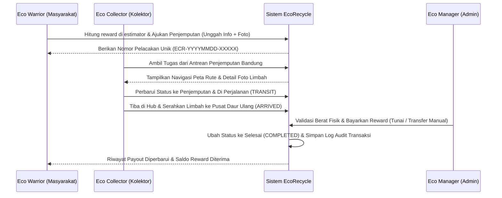

# EcoRecycle - Smart E-Waste Recycling Management Platform (V2.0)

EcoRecycle adalah platform inovatif yang dirancang untuk mengelola rantai pasok pengumpulan dan daur ulang khusus sampah elektronik (e-waste) di wilayah Bandung (Kota, Kabupaten, dan KBB). Platform ini memfasilitasi siklus hidup produk elektronik mulai dari akhir penggunaan (end-of-life) hingga proses daur ulang yang bertanggung jawab di hub daur ulang, sambil memberikan insentif ekonomi digital secara langsung kepada pengguna.

---

## 🌟 Deskripsi Proyek
Masalah sampah elektronik (e-waste) global terus meningkat secara eksponensial. EcoRecycle hadir sebagai jembatan yang menghubungkan konsumen (**Eco Warriors**), mitra penjemputan lapangan (**Eco Collectors**), dan manajer keuangan/operasional (**Eco Managers/Admin**). Dengan sistem pelacakan berbasis tracking number unik dan pembayaran reward langsung (tunai/transfer manual), platform ini memastikan e-waste tidak berakhir di TPA, melainkan didaur ulang secara aman demi mendukung ekonomi sirkular.

---

## 🛠️ Fitur Utama

1. **Carbon & Eco-Reward Estimator**: Hitung potensi reward finansial dan kontribusi pengurangan emisi CO2 berdasarkan berat (KG) dan kategori sampah elektronik secara dinamis.
2. **E-Waste Tracking Timeline**: Lacak perjalanan sampah elektronik Anda dengan timeline interaktif (Pending ➔ Dijemput ➔ Transit ➔ Tiba di Hub ➔ Selesai & Dibayar).
3. **Photo Upload Verification**: Fitur unggah foto limbah elektronik saat mengajukan penjemputan untuk memudahkan kolektor melakukan verifikasi visual kondisi awal barang secara remote.
4. **Direct Eco-Rewards Payout**: Pembayaran kompensasi reward secara langsung (tunai atau transfer bank manual) oleh Eco Manager sesaat setelah sampah elektronik tiba di hub dan diverifikasi timbangan fisiknya.
5. **Gamified Eco-Level & Impact Score**: Klasifikasi tingkatan pengguna berdasarkan akumulasi berat sampah elektronik yang didonasikan (Bronze Saver, Silver Guardian, Emerald Hero) yang dihitung secara dinamis.
6. **Interactive Maps (Leaflet.js)**: Pemetaan visual rute perjalanan dan penentuan titik koordinat penjemputan donor oleh kolektor secara interaktif di wilayah Bandung.
7. **Multi-Role Dashboard**: Panel terintegrasi untuk 3 target pengguna utama:
   - **Eco Warriors** (Melihat status donasi, grafik tren bulanan, estimasi karbon, unggah foto sampah, & history payout).
   - **Eco Collectors** (Menerima antrean pickup Bandung, navigasi maps, & klaim komisi hasil penjemputan).
   - **Eco Managers / Admin** (Analitik volume e-waste, live map kolektor, & validasi pembayaran reward secara manual).

---

## 📐 Arsitektur & Teknologi

### Tech Stack
- **Backend**: PHP 7.4 / 8.x (Native MVC Architecture dengan Prepared Statements & Signed Token)
- **Database**: MySQL / MariaDB (Optimasi Skema)
- **Environment Variables**: Pemuatan konfigurasi dinamis via loader `.env` native tanpa dependensi eksternal.
- **Frontend**: HTML5, Vanilla CSS3 (Modern Tech HSL Design), JavaScript (Vanilla ES6)
- **Pustaka**: SweetAlert2 (Notifikasi UI), Leaflet.js (Peta Rute), Chart.js (Grafik Tren Bulanan)

### Persyaratan Sistem
- **Server**: Apache / Nginx (XAMPP / Laragon)
- **PHP Version**: 7.4 ke atas (dengan ekstensi `mysqli` dan `json` aktif)
- **Database**: MySQL 5.7+ atau MariaDB 10.4+

---

## 📁 Struktur Folder Proyek
```text
/tubes_pemrograman3
├── app/
│   ├── Config/         # Konfigurasi Database & Global
│   │   └── Database.php
│   ├── Controllers/    # Handler API & Logika Bisnis (MVC)
│   │   ├── BaseController.php      # Controller Induk (Signed Tokens, REST Codes, Env Loader)
│   │   ├── AuthController.php      # Autentikasi & Registrasi (Validasi email/sandi)
│   │   └── EcoRecycleController.php # Logika E-Waste, Upload Gambar, & Payout
│   ├── Models/         # Abstraksi Data & Query SQL (MVC)
│   │   ├── User.php
│   │   └── WastePickup.php         # Operasi CRUD E-waste & Kategori DB
│   └── Views/          # Template Antarmuka HTML
│       ├── index.html              # Landing Page Edukatif (Workflow & Bahaya B3)
│       ├── login.html              # Autentikasi Masuk
│       ├── register.html           # Pendaftaran Akun
│       ├── dashboard.html          # Portal Eco Warrior
│       ├── collector.html          # Portal Eco Collector
│       ├── admin.html              # Portal Eco Manager
│       └── profile.html            # Manajemen Akun & Profil Pengguna
├── assets/
│   ├── css/            # UI Styling (style.css, admin.css, dashboard.css, collector.css)
│   ├── js/             # Front Logic (home.js, auth.js, dashboard.js, admin.js, collector.js)
│   └── img/            # Aset Gambar & Media
├── uploads/            # Direktori penyimpanan foto sampah elektronik (Diabaikan oleh Git)
├── .env                # Kredensial database & Kunci Keamanan lokal (Aman / Git-ignored)
├── .env.example        # Template konfigurasi environment variables untuk kolaborator
├── .gitignore          # Konfigurasi Git untuk mengabaikan berkas sensitif & uploads/
├── index.php           # Front Controller, API Router, & .env Loader
├── setup.php           # Database Auto-Installer, Seeder, & .env Loader
└── README.md           # Dokumentasi Teknis Lengkap
```

---

## 🔒 Skema Keamanan & Database

Basis data `ecorecycle` menggunakan relasi data yang optimal dengan skema berikut:

### Keamanan Web Service
1. **SQL Injection Prevention**: Seluruh operasi query database di layer Model menggunakan **Prepared Statements** (`$conn->prepare()`, `bind_param()`) secara konsisten.
2. **Stateless API Authentication**: Menggunakan sistem **Signed Token kustom** berbasis algoritma **HMAC SHA-256** untuk menjamin keamanan request API tanpa menggunakan session PHP standar (mencegah pembajakan sesi).
3. **Pemisahan Kredensial**: Semua data sensitif (password DB, JWT Secret Key) disimpan di file `.env` yang diabaikan oleh Git.
4. **Server-Side Input Validation**: 
   - Validasi format email riil menggunakan `FILTER_VALIDATE_EMAIL`.
   - Validasi kekuatan kata sandi minimal 6 karakter saat registrasi.
   - Validasi tipe data numerik positif untuk berat limbah (mencegah nilai negatif).

### Skema Tabel Database
1. **Tabel `users`**: Menyimpan akun pengguna. Password diamankan dengan hash `password_hash()`.
2. **Tabel `waste_categories`**: Daftar kategori sampah elektronik dan rate reward per kilogram (KG).
3. **Tabel `pickups`**: Tabel transaksi donasi utama. Dilengkapi kolom `photo_url` untuk foto limbah dan kolom `collector_id` untuk pemetaan kurir penjemput.
4. **Tabel `pickup_history`**: Mencatat detail lini masa dan riwayat mutasi status donasi.
5. **Tabel `transactions`**: Menyimpan log audit transaksi payout reward langsung ke masyarakat.

---

## 🚀 Panduan Instalasi (Lokal XAMPP)

### 1. Setup Proyek
1. Clone repositori ini dan letakkan di direktori root server lokal Anda.
   (Contoh: `C:/xampp/htdocs/progress_tubes/tubes_pemrograman3/`).
2. Pastikan MySQL/MariaDB server Anda sudah aktif di XAMPP Control Panel.

### 2. Konfigurasi Environment (.env)
1. Salin berkas `.env.example` menjadi `.env`:
   ```bash
   cp .env.example .env
   ```
2. Sesuaikan kredensial basis data Anda (seperti port, user, password DB) di dalam `.env`.

### 3. Inisialisasi Database
Jalankan skrip auto-installer melalui command line di direktori proyek:
```bash
php setup.php
```

### 4. Kredensial Akun Demo
Login menggunakan kredensial demo berikut (password default: `password123`):
* **Eco Manager (Admin)**: `admin@ecorecycle.com`
* **Eco Collector (Kolektor)**: `collector@ecorecycle.com`
* **Eco Warrior (User)**: `user@ecorecycle.com`

---

## 🌐 Dokumentasi API (Web Service)

Semua request API mengembalikan respons JSON seragam dengan header CORS dan HTTP response status codes yang tepat (misal: 201 Created, 401 Unauthorized, 405 Method Not Allowed).

### 1. Autentikasi Pengguna
* **Login**: `POST /api/auth/login`
  - Input: `{"email": "...", "password": "..."}`
  - Output: Mengembalikan Signed Token (HMAC SHA256) untuk hak akses di request berikutnya.
* **Register**: `POST /api/auth/register`
  - Input: `{"name": "...", "email": "...", "password": "...", "role": "user"}`
  - Fitur: Memvalidasi format email dan panjang sandi minimal 6 karakter.

### 2. Pengelolaan E-Waste (Memerlukan Token Autentikasi)
* **Request Penjemputan**: `POST /api/ecorecycle/request_pickup` (Multipart Form-Data)
  - Header: `Authorization: Bearer <token>`
  - Input: `item_description` (text), `pickup_address` (text), `contact_phone` (text), `weight_kg` (numeric > 0), `category` (text), `photo` (file gambar - opsional)
* **Ambil Tugas (Kolektor)**: `POST /api/ecorecycle/assign_collector`
  - Header: `Authorization: Bearer <token>`
  - Input: `{"tracking_number": "ECR-XXXX-XXXXX"}`
* **Pembaruan Status Misi**: `POST /api/ecorecycle/pickup_status`
  - Header: `Authorization: Bearer <token>`
  - Input: `{"tracking_number": "ECR-...", "status": "transit|arrived", "location": "...", "notes": "..."}`
* **Lacak Tracking Number**: `GET /api/ecorecycle/pickup_status?tracking_number=ECR-...`
* **Kalkulator Estimator**: `POST /api/ecorecycle/estimate_reward`
  - Input: `{"category": "...", "weight_kg": ...}`
  - Fitur: Mengambil data tarif terkini dari database MySQL secara real-time.
* **Pencairan Reward (Admin)**: `POST /api/ecorecycle/process_payout`
  - Header: `Authorization: Bearer <token>`
  - Input: `{"pickup_id": ...}`

---

## 🔄 Alur Kerja Sistem (Workflow)



---

## 🛠️ Pemecahan Masalah (Troubleshooting)

1. **Gagal Setup Database / Connection Refused**: Pastikan MySQL di XAMPP Control Panel sudah aktif. Jika Anda menggunakan port non-standar (misalnya `3307`), buka file `.env` dan ubah `DB_HOST=localhost` menjadi `DB_HOST=localhost:3307`.
2. **Koneksi Database Terputus**: Pastikan driver `mysqli` terpasang di modul PHP server Anda.
3. **API Mengembalikan Error 401**: Pastikan header `Authorization` dikirimkan dalam format `Bearer <token>` dan token belum kadaluwarsa (berlaku 24 jam setelah login).
4. **Tombol Log Out Menghasilkan 404**: Ini sudah diperbaiki secara menyeluruh dengan memperbarui target link pengalihan dari `'auth'` menjadi `'login'` yang valid di `dashboard.js`, `collector.js`, `admin.js`, dan `profile.html`.

---

## 📈 Persentase Progress Aplikasi saat ini
### **Progress Aplikasi: 100% Selesai & Siap Digunakan**
Seluruh modul utama dan penyempurnaan sesuai standar akademis telah berhasil diselesaikan:
- [x] **Arsitektur MVC & REST API Base Controller** (100% Selesai)
- [x] **Keamanan Signed Token HMAC-SHA256 Stateless** (100% Selesai)
- [x] **Manajemen Konfigurasi Lingkungan Dinamis (.env)** (100% Selesai)
- [x] **Validasi Masukan di Sisi Server (Email & Berat Numerik Positif)** (100% Selesai)
- [x] **Integrasi Database Real-Time pada Kalkulator Estimator** (100% Selesai)
- [x] **Fitur Unggah Foto E-Waste di Dasbor & Penyimpanan Backend** (100% Selesai)
- [x] **Landing Page Hibrida (Panduan Alur & Edukasi B3 Lingkungan)** (100% Selesai)
- [x] **Perbaikan Bug Redirect Halaman 404 Log Out** (100% Selesai)
- [x] **Konfigurasi Git (.gitignore & .env.example)** (100% Selesai)
